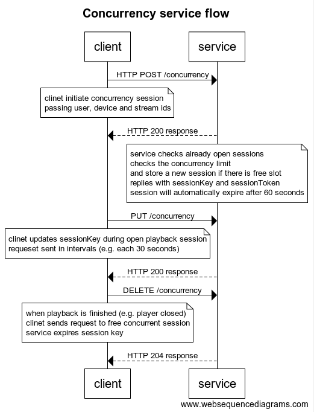

# interview-concurrency-service

Interview task: implement concurrency service to check number of video streams run simultaneously

Service is hosted on: http://pk-concurrency-service-lb-1804676257.us-east-1.elb.amazonaws.com/
(mind the http there is no certificate attached to Application Load Balancer)

Supports the check of number of the simultaneously played streams by single user

OpenAPI yaml is described in [here](./docs/service.yml)

## Description

Service flow

Concurrency service should be called by client (FE player or Playback API service) in following scenarios:

- Start of playback
- Heartbeat requests: player sends heartbeats to update the TTL of the session in regular time intervals
- Player is closed / Playback terminated

The diagram of requests flow displayed below:



For simplicity task allowed to ignore authentication part. So all parameters are passed and returned as a plain text payload.
It worth to mention that initial playback on production most probably will require authorization token, so parameters
like deviceId and userId could be taken from token claim (alternatively device id may be sort of userAgent string)

Concurrency service request shall return data in jwt token claims as well.

## Build with

Service using serverless architecture and is built with AWS lambda function, Elasticache Redis cluster and Application Load Balancer.
It relies on AWS capability of scaling.

## Installing / Building

```bash
npm install
npm run build
cd infra
terraform init
terraform apply
```

build command produces package.zip file which is used later run in AWS Lambda function
necessary infrastructure is provisioned by terraform

### Prerequisites

- git
- node
- npm
- terraform
- docker / local redis instance (for component tests)

To be able to deploy the application you need installed terraform. Your default AWS profile credentials will be used.

To run component tests `npm run test-component` you need an instance of redis service to be running on localhost:6379

If you have it running on different port / host please edit `test/component/setup.spec.js`

To run docker in docker use a commands:

```bash
docker pull redis
docker run -d -p 6379:6379 --name local-redis redis
```

## Testing

There are two group of tests:

Unit testing, with stubs for some calls and component testing which uses the local redis cache and simulates calls to API

To run unit tests execute `npm run test`
